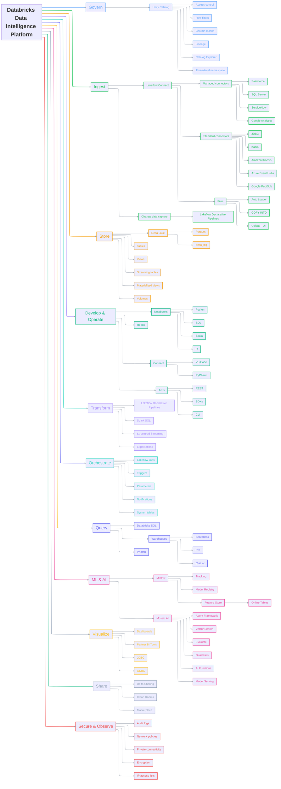

```mermaid
---
config:
  layout: elk
  elk:
    mergeEdges: false
    nodePlacementStrategy: BRANDES_KOEPF
  flowchart:
    nodeSpacing: 24
    rankSpacing: 48
    curve: basis
    htmlLabels: true
    padding: 8
---
%% nodePlacementStrategy: LINEAR_SEGMENTS | SIMPLE | NETWORK_SIMPLEX | BRANDES_KOEPF
%% cycleBreakingStrategy: GREEDY | DEPTH_FIRST | INTERACTIVE | MODEL_ORDER | GREEDY_MODEL_ORDER

flowchart LR
  R["Databricks Data Intelligence Platform"]

  %% Level 1 domains
  R --> G0[Govern]
  R --> I0[Ingest]
  R --> S0[Store]
  R --> D0[Develop & Operate]
  R --> T0[Transform]
  R --> O0[Orchestrate]
  R --> Q0[Query]
  R --> M0[ML & AI]
  R --> V0[Visualize]
  R --> SH0[Share]
  R --> SE0[Secure & Observe]

  %% Govern
  G0 --> G1[Unity Catalog]
  G1 --> G1a[Access control]
  G1 --> G1b[Row filters]
  G1 --> G1c[Column masks]
  G1 --> G1d[Lineage]
  G1 --> G1e[Catalog Explorer]
  G1 --> G1f[Three-level namespace]

  %% Ingest
  I0 --> I1[Lakeflow Connect]
  I1 --> I1a[Managed connectors]
  I1a --> I1a1[Salesforce]
  I1a --> I1a2[SQL Server]
  I1a --> I1a3[ServiceNow]
  I1a --> I1a4[Google Analytics]
  I1 --> I1b[Standard connectors]
  I1b --> I1b1[JDBC]
  I1b --> I1b2[Kafka]
  I1b --> I1b3[Amazon Kinesis]
  I1b --> I1b4[Azure Event Hubs]
  I1b --> I1b5[Google Pub/Sub]
  I1 --> I1c[Files]
  I1c --> I1c1[Auto Loader]
  I1c --> I1c2[COPY INTO]
  I1c --> I1c3[Upload - UI]
  I0 --> I2[Change data capture]
  I2 --> I2a[Lakeflow Declarative Pipelines]

  %% Store
  S0 --> S1[Delta Lake]
  S1 --> S1a[Parquet]
  S1 --> S1b[delta_log]
  S0 --> S2[Tables]
  S0 --> S3[Views]
  S0 --> S4[Streaming tables]
  S0 --> S5[Materialized views]
  S0 --> S6[Volumes]

  %% Develop & Operate
  D0 --> D1[Notebooks]
  D1 --> D1a[Python]
  D1 --> D1b[SQL]
  D1 --> D1c[Scala]
  D1 --> D1d[R]
  D0 --> D2[Repos]
  D0 --> D3[Connect]
  D3 --> D3a[VS Code]
  D3 --> D3b[PyCharm]
  D0 --> D4[APIs]
  D4 --> D4a[REST]
  D4 --> D4b[SDKs]
  D4 --> D4c[CLI]
  
  %% Transform
  T0 --> T1[Lakeflow Declarative Pipelines]
  T0 --> T2[Spark SQL]
  T0 --> T3[Structured Streaming]
  T0 --> T4[Expectations]

  %% Orchestrate
  O0 --> O1[Lakeflow Jobs]
  O0 --> O2[Triggers]
  O0 --> O3[Parameters]
  O0 --> O4[Notifications]
  O0 --> O5[System tables]

  %% Query
  Q0 --> Q1[Databricks SQL]
  Q0 --> Q2[Warehouses]
  Q2 --> Q2a[Serverless]
  Q2 --> Q2b[Pro]
  Q2 --> Q2c[Classic]
  Q0 --> Q3[Photon]

  %% ML & AI
  M0 --> M1[MLflow]
  M1 --> M1a[Tracking]
  M1 --> M1b[Model Registry]
  M1 --> M1c[Feature Store]
  M1c --> M1c1[Online Tables]
  M0 --> M2[Mosaic AI]
  M2 --> M2a[Agent Framework]
  M2 --> M2b[Vector Search]
  M2 --> M2c[Evaluate]
  M2 --> M2d[Guardrails]
  M2 --> M2e[AI Functions]
  M2 --> M2f[Model Serving]

  %% Visualize
  V0 --> V1[Dashboards]
  V0 --> V2[Partner BI Tools]
  V0 --> V3[JDBC]
  V0 --> V4[ODBC]
  
  %% Share
  SH0 --> SH1[Delta Sharing]
  SH0 --> SH2[Clean Rooms]
  SH0 --> SH3[Marketplace]

  %% Secure & Observe
  SE0 --> SE1[Audit logs]
  SE0 --> SE2[Network policies]
  SE0 --> SE3[Private connectivity]
  SE0 --> SE4[Encryption]
  SE0 --> SE5[IP access lists]


%% domain colors (single source of truth for node + edge color)
classDef govern color:#60a5fa,stroke:#60a5fa,stroke-width:2px;
classDef ingest color:#22c55e,stroke:#22c55e,stroke-width:2px;
classDef store color:#f59e0b,stroke:#f59e0b,stroke-width:2px;
classDef transform color:#a78bfa,stroke:#a78bfa,stroke-width:2px;
classDef orchestrate color:#2dd4bf,stroke:#2dd4bf,stroke-width:2px;
classDef query color:#6366f1,stroke:#6366f1,stroke-width:2px;
classDef visualize color:#fbbf24,stroke:#fbbf24,stroke-width:2px;
classDef mlai color:#ec4899,stroke:#ec4899,stroke-width:2px;
classDef share color:#94a3b8,stroke:#94a3b8,stroke-width:2px;
classDef devops color:#10b981,stroke:#10b981,stroke-width:2px;
classDef secure color:#ef4444,stroke:#ef4444,stroke-width:2px;

%% hierarchical font sizes (top -> bottom)
classDef level0 font-size:1.25em,font-weight:700;
classDef level1 font-size:1.15em;


%% apply classes
%% apply hierarchy levels
class R level0;
class G0,I0,S0,D0,T0,O0,Q0,M0,V0,SH0,SE0 level1;
class G1,I1,I2,S1,S2,S3,S4,S5,S6,D1,D2,D3,D4,T1,T2,T3,T4,O1,O2,O3,O4,O5,Q1,Q2,Q3,M1,M2,V1,V2,V3,V4,SH1,SH2,SH3,SE1,SE2,SE3,SE4,SE5 level2;
class G1a,G1b,G1c,G1d,G1e,G1f,I1a,I1b,I1c,I2a,S1a,S1b,D1a,D1b,D1c,D1d,D3a,D3b,D4a,D4b,D4c,Q2a,Q2b,Q2c,M1a,M1b,M1c,M2a,M2b,M2c,M2d,M2e,M2f level3;
class I1a1,I1a2,I1a3,I1a4,I1b1,I1b2,I1b3,I1b4,I1b5,I1c1,I1c2,I1c3,M1c1 level4;

class G0,G1,G1a,G1b,G1c,G1d,G1e,G1f govern;
class I0,I1,I1a,I1a1,I1a2,I1a3,I1a4,I1b,I1b1,I1b2,I1b3,I1b4,I1b5,I1c,I1c1,I1c2,I1c3,I2,I2a ingest;
class S0,S1,S1a,S1b,S2,S3,S4,S5,S6 store;
class T0,T1,T2,T3,T4 transform;
class O0,O1,O2,O3,O4,O5 orchestrate;
class Q0,Q1,Q2,Q2a,Q2b,Q2c,Q3 query;
class V0,V1,V2,V3,V4 visualize;
class M0,M1,M1a,M1b,M1c,M1c1,M2,M2a,M2b,M2c,M2d,M2e,M2f mlai;
class SH0,SH1,SH2,SH3 share;
class D0,D1,D1a,D1b,D1c,D1d,D2,D3,D3a,D3b,D4,D4a,D4b,D4c devops;
class SE0,SE1,SE2,SE3,SE4,SE5 secure;

%% default link style
linkStyle default stroke:#9CA3AF,stroke-width:1.2px;
linkStyle 0 stroke:#60a5fa,stroke-width:2px;
linkStyle 1 stroke:#22c55e,stroke-width:2px;
linkStyle 2 stroke:#f59e0b,stroke-width:2px;
linkStyle 3 stroke:#a78bfa,stroke-width:2px;
linkStyle 4 stroke:#2dd4bf,stroke-width:2px;
linkStyle 5 stroke:#6366f1,stroke-width:2px;
linkStyle 6 stroke:#fbbf24,stroke-width:2px;
linkStyle 7 stroke:#ec4899,stroke-width:2px;
linkStyle 8 stroke:#94a3b8,stroke-width:2px;
linkStyle 9 stroke:#10b981,stroke-width:2px;
linkStyle 10 stroke:#ef4444,stroke-width:2px;
```