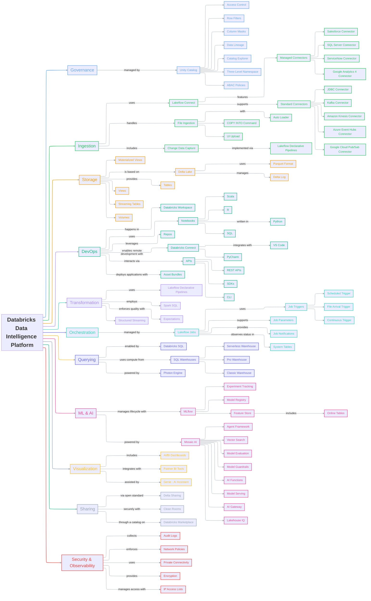

```mermaid
---
config:
  layout: elk
  elk:
    mergeEdges: false
    nodePlacementStrategy: NETWORK_SIMPLEX
    algorithm: radial
  flowchart:
    defaultRenderer: dagre
    curve: basis
    nodeSpacing: 24
    rankSpacing: 48
    htmlLabels: false
    padding: 0
---

flowchart LR
    R["Databricks Data Intelligence Platform"]

%% Level 1 domains (These are good as nouns, representing categories of concepts)
    R --> G0[Governance]
    R --> I0[Ingestion]
    R --> S0[Storage]
    R --> D0[DevOps]
    R --> T0[Transformation]
    R --> O0[Orchestration]
    R --> Q0[Querying]
    R --> M0[ML & AI]
    R --> V0[Visualization]
    R --> SH0[Sharing]
    R --> SE0[Security & Observability]

%% Governance (G0)
    G0 -->|managed by| G1[Unity Catalog]
    G1 --> G1a[Access Control]
    G1 --> G1b[Row Filters]
    G1 --> G1c[Column Masks]
    G1 --> G1d[Data Lineage]
    G1 --> G1e[Catalog Explorer]
    G1 --> G1f[Three-Level Namespace]
    G1 --> G1g[ABAC Policies]

%% Ingestion (I0)
    I0 -->|uses| I1[Lakeflow Connect]
    I1 -->|features| I1a[Managed Connectors]
    I1a --> I1a1[Salesforce Connector]
    I1a --> I1a2[SQL Server Connector]
    I1a --> I1a3[ServiceNow Connector]
    I1a --> I1a4[Google Analytics 4 Connector]
    I1 -->|supports| I1b[Standard Connectors]
    I1b --> I1b1[JDBC Connector]
    I1b --> I1b2[Kafka Connector]
    I1b --> I1b3[Amazon Kinesis Connector]
    I1b --> I1b4[Azure Event Hubs Connector]
    I1b --> I1b5[Google Cloud Pub/Sub Connector]
    I0 -->|handles| I1c[File Ingestion]
    I1c -->|with| I1c1[Auto Loader]
    I1c --> I1c2[COPY INTO Command]
    I1c --> I1c3[UI Upload]
    I0 -->|includes| I2[Change Data Capture]
    I2 -->|implemented via| I2a[Lakeflow Declarative Pipelines]

    %% Storage (S0)
    S0 -->|is based on| S1[Delta Lake]
    S1 -->|uses| S1a[Parquet Format]
    S1 -->|manages| S1b[Delta Log]
    S0 -->|provides| S2[Tables]
    S0 --> S3[Views]
    S0 --> S4[Streaming Tables]
    S0 --> S5[Materialized Views]
    S0 --> S6[Volumes]
    
    %% DevOps (D0)
    D0 -->|happens in| Da[Databricks Workspace]
    D0 -->|uses| D1[Notebooks]
    D1 -->|written in| D1a[Python]
    D1 --> D1b[SQL]
    D1 --> D1c[Scala]
    D1 --> D1d[R]
    D0 -->|leverages| D2[Repos]
    D0 -->|enables remote development with| D3[Databricks Connect]
    D3 -->|integrates with| D3a[VS Code]
    D3 --> D3b[PyCharm]
    D0 -->|interacts via| D4[APIs]
    D4 --> D4a[REST APIs]
    D4 --> D4b[SDKs]
    D4 --> D4c[CLI]
    D0 -->|deploys applications with| D5[Asset Bundles]
    
    %% Transformation (T0)
    T0 -->|uses| T1[Lakeflow Declarative Pipelines]
    T0 -->|employs| T2[Spark SQL]
    T0 --> T3[Structured Streaming]
    T0 -->|enforces quality with| T4[Expectations]
    
    %% Orchestration (O0)
    O0 -->|managed by| O1[Lakeflow Jobs]
    O1 -->|uses| O2[Job Triggers]
    O2 --> O2a[Scheduled Trigger]
    O2 --> O2b[File Arrival Trigger]
    O2 --> O2c[Continuous Trigger]
    O1 -->|supports| O3[Job Parameters]
    O1 -->|provides| O4[Job Notifications]
    O1 -->|observes status in| O5[System Tables]
    
    %% Querying (Q0)
    Q0 -->|enabled by| Q1[Databricks SQL]
    Q0 -->|uses compute from| Q2[SQL Warehouses]
    Q2 --> Q2a[Serverless Warehouse]
    Q2 --> Q2b[Pro Warehouse]
    Q2 --> Q2c[Classic Warehouse]
    Q0 -->|powered by| Q3[Photon Engine]
    
    %% ML & AI (M0)
    M0 -->|manages lifecycle with| M1[MLflow]
    M1 --> M1a[Experiment Tracking]
    M1 --> M1b[Model Registry]
    M1 --> M1c[Feature Store]
    M1c -->|includes| M1c1[Online Tables]
    M0 -->|powered by| M2[Mosaic AI]
    M2 --> M2a[Agent Framework]
    M2 --> M2b[Vector Search]
    M2 --> M2c[Model Evaluation]
    M2 --> M2d[Model Guardrails]
    M2 --> M2e[AI Functions]
    M2 --> M2f[Model Serving]
    M2 --> M2g[AI Gateway]
    M2 --> M2h[Lakehouse IQ]
    
    %% Visualization (V0)
    V0 -->|includes| V1[AI/BI Dashboards]
    V0 -->|integrates with| V2[Partner BI Tools]
    V0 -->|assisted by| V3[Genie - AI Assistant]
    
    %% Sharing (SH0)
    SH0 -->|via open standard| SH1[Delta Sharing]
    SH0 -->|securely with| SH2[Clean Rooms]
    SH0 -->|through a catalog on| SH3[Databricks Marketplace]
    
    %% Security & Observability (SE0)
    SE0 -->|collects| SE1[Audit Logs]
    SE0 -->|enforces| SE2[Network Policies]
    SE0 -->|uses| SE3[Private Connectivity]
    SE0 -->|provides| SE4[Encryption]
    SE0 -->|manages access with| SE5[IP Access Lists]


%% domain colors (single source of truth for node + edge color)
classDef govern color:#60a5fa,stroke:#60a5fa,stroke-width:2px;
classDef ingest color:#22c55e,stroke:#22c55e,stroke-width:2px;
classDef store color:#f59e0b,stroke:#f59e0b,stroke-width:2px;
classDef transform color:#a78bfa,stroke:#a78bfa,stroke-width:2px;
classDef orchestrate color:#2dd4bf,stroke:#2dd4bf,stroke-width:2px;
classDef query color:#6366f1,stroke:#6366f1,stroke-width:2px;
classDef visualize color:#fbbf24,stroke:#fbbf24,stroke-width:2px;
classDef mlai color:#ec4899,stroke:#ec4899,stroke-width:2px;
classDef share color:#94a3b8,stroke:#94a3b8,stroke-width:2px;
classDef devops color:#10b981,stroke:#10b981,stroke-width:2px;
classDef secure color:#ef4444,stroke:#ef4444,stroke-width:2px;

%% hierarchical font sizes (top -> bottom)
classDef level0 font-size:1.25em,font-weight:700;
classDef level1 font-size:1.15em;


%% apply classes
%% apply hierarchy levels
class R level0;
class G0,I0,S0,D0,T0,O0,Q0,M0,V0,SH0,SE0 level1;
class G1,I1,I2,S1,S2,S3,S4,S5,S6,D1,D2,D3,D4,D5,T1,T2,T3,T4,O1,O2,O3,O4,O5,Q1,Q2,Q3,M1,M2,V1,V2,V3,SH1,SH2,SH3,SE1,SE2,SE3,SE4,SE5 level2;
class G1a,G1b,G1c,G1d,G1e,G1f,I1a,I1b,I1c,I2a,S1a,S1b,D1a,D1b,D1c,D1d,D3a,D3b,D4a,D4b,D4c,Q2a,Q2b,Q2c,M1a,M1b,M1c,M2a,M2b,M2c,M2d,M2e,M2f,G1g,O2a,O2b,O2c,M2g,M2h level3;
class I1a1,I1a2,I1a3,I1a4,I1b1,I1b2,I1b3,I1b4,I1b5,I1c1,I1c2,I1c3,M1c1 level4;

class G0,G1,G1a,G1b,G1c,G1d,G1e,G1f,G1g govern;
class I0,I1,I1a,I1a1,I1a2,I1a3,I1a4,I1b,I1b1,I1b2,I1b3,I1b4,I1b5,I1c,I1c1,I1c2,I1c3,I2,I2a ingest;
class S0,S1,S1a,S1b,S2,S3,S4,S5,S6 store;
class T0,T1,T2,T3,T4 transform;
class O0,O1,O2,O3,O4,O5,O2a,O2b,O2c orchestrate;
class Q0,Q1,Q2,Q2a,Q2b,Q2c,Q3 query;
class V0,V1,V2,V3 visualize;
class M0,M1,M1a,M1b,M1c,M1c1,M2,M2a,M2b,M2c,M2d,M2e,M2f,M2g,M2h mlai;
class SH0,SH1,SH2,SH3 share;
class D0,Da,D1,D1a,D1b,D1c,D1d,D2,D3,D3a,D3b,D4,D4a,D4b,D4c,D5 devops;
class SE0,SE1,SE2,SE3,SE4,SE5 secure;

%% default link style
linkStyle default stroke:#9CA3AF,stroke-width:1.2px;
linkStyle 0 stroke:#60a5fa,stroke-width:2px;
linkStyle 1 stroke:#22c55e,stroke-width:2px;
linkStyle 2 stroke:#f59e0b,stroke-width:2px;
linkStyle 3 stroke:#a78bfa,stroke-width:2px;
linkStyle 4 stroke:#2dd4bf,stroke-width:2px;
linkStyle 5 stroke:#6366f1,stroke-width:2px;
linkStyle 6 stroke:#fbbf24,stroke-width:2px;
linkStyle 7 stroke:#ec4899,stroke-width:2px;
linkStyle 8 stroke:#94a3b8,stroke-width:2px;
linkStyle 9 stroke:#10b981,stroke-width:2px;
linkStyle 10 stroke:#ef4444,stroke-width:2px;
```