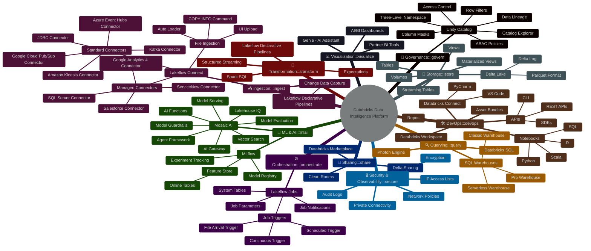

```mermaid
---
config:
  theme: dark
  mindmap:
    useMaxWidth: true
  themeVariables:
    lineColor: #9CA3AF
    textColor: #E5E7EB
    themeVariables:
      fontSize: 16px
      mindmapBranchSpacing: 1600
      mindmapLeafSpacing: 1300
      mindmapPadding: 2140
  styles:
    govern: { fill: "#60a5fa", stroke: "#60a5fa", color: "#fff" }
    ingest: { fill: "#22c55e", stroke: "#22c55e", color: "#fff" }
    store: { fill: "#f59e0b", stroke: "#f59e0b", color: "#fff" }
    devops: { fill: "#10b981", stroke: "#10b981", color: "#fff" }
    transform: { fill: "#a78bfa", stroke: "#a78bfa", color: "#fff" }
    orchestrate: { fill: "#2dd4bf", stroke: "#2dd4bf", color: "#fff" }
    query: { fill: "#6366f1", stroke: "#6366f1", color: "#fff" }
    mlai: { fill: "#ec4899", stroke: "#ec4899", color: "#fff" }
    visualize: { fill: "#fbbf24", stroke: "#fbbf24", color: "#000" }
    share: { fill: "#94a3b8", stroke: "#94a3b8", color: "#fff" }
    secure: { fill: "#ef4444", stroke: "#ef4444", color: "#fff" }
---

mindmap
  root((Databricks Data Intelligence Platform))
    📜 Governance:::govern
      Unity Catalog
        Access Control
        Row Filters
        Column Masks
        Data Lineage
        Catalog Explorer
        Three-Level Namespace
        ABAC Policies
    📥 Ingestion:::ingest
      Lakeflow Connect
        Managed Connectors
          Salesforce Connector
          SQL Server Connector
          ServiceNow Connector
          Google Analytics 4 Connector
        Standard Connectors
          JDBC Connector
          Kafka Connector
          Amazon Kinesis Connector
          Azure Event Hubs Connector
          Google Cloud Pub/Sub Connector
        File Ingestion
          Auto Loader
          COPY INTO Command
          UI Upload
      Change Data Capture
        Lakeflow Declarative Pipelines
    💾 Storage:::store
      Delta Lake
        Parquet Format
        Delta Log
      Tables
      Views
      Streaming Tables
      Materialized Views
      Volumes
    🛠 DevOps:::devops
      Databricks Workspace
      Notebooks
        Python
        SQL
        Scala
        R
      Repos
      Databricks Connect
        VS Code
        PyCharm
      APIs
        REST APIs
        SDKs
        CLI
      Asset Bundles
    🔄 Transformation:::transform
      Lakeflow Declarative Pipelines
      Spark SQL
      Structured Streaming
      Expectations
    ⏱ Orchestration:::orchestrate
      Lakeflow Jobs
        Job Triggers
          Scheduled Trigger
          File Arrival Trigger
          Continuous Trigger
        Job Parameters
        Job Notifications
        System Tables
    🔍 Querying:::query
      Databricks SQL
      SQL Warehouses
        Serverless Warehouse
        Pro Warehouse
        Classic Warehouse
      Photon Engine
    🧠 ML & AI:::mlai
      MLflow
        Experiment Tracking
        Model Registry
        Feature Store
          Online Tables
      Mosaic AI
        Agent Framework
        Vector Search
        Model Evaluation
        Model Guardrails
        AI Functions
        Model Serving
        AI Gateway
        Lakehouse IQ
    📊 Visualization:::visualize
      AI/BI Dashboards
      Partner BI Tools
      Genie - AI Assistant
    🤝 Sharing:::share
      Delta Sharing
      Clean Rooms
      Databricks Marketplace
    🔒 Security & Observability:::secure
      Audit Logs
      Network Policies
      Private Connectivity
      Encryption
      IP Access Lists
```