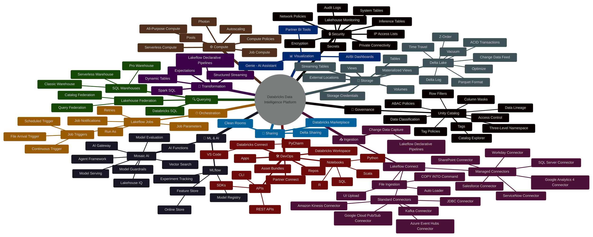

```mermaid
---
config:
  theme: dark
  mindmap:
    useMaxWidth: false
    branchSpacing: 880
    leafSpacing: 820
    padding: 16
  themeVariables:
    lineColor: "#9CA3AF"
    textColor: "#E5E7EB"
    fontSize: 16px
---

mindmap
  root((Databricks Data Intelligence Platform))
    📜 Governance
      Unity Catalog
        Access Control
        Row Filters
        Column Masks
        Data Lineage
        Catalog Explorer
        Three-Level Namespace
        ABAC Policies
        Tags
        Tag Policies
        Data Classification
    📥 Ingestion
      Lakeflow Connect
        Managed Connectors
          Salesforce Connector
          SQL Server Connector
          ServiceNow Connector
          Google Analytics 4 Connector
          Workday Connector
          SharePoint Connector
        Standard Connectors
          JDBC Connector
          Kafka Connector
          Amazon Kinesis Connector
          Azure Event Hubs Connector
          Google Cloud Pub/Sub Connector
        File Ingestion
          Auto Loader
          COPY INTO Command
          UI Upload
      Change Data Capture
        Lakeflow Declarative Pipelines
    💾 Storage
      Delta Lake
        Parquet Format
        Delta Log
        Change Data Feed
        Time Travel
        Optimize
        Z-Order
        Vacuum
        ACID Transactions
      Tables
      Views
      Streaming Tables
      Materialized Views
      Volumes
      External Locations
      Storage Credentials
    ⚙️ Compute
      All-Purpose Compute
      Job Compute
      Serverless Compute
      Compute Policies
      Pools
      Autoscaling
      Photon
    🛠 DevOps
      Databricks Workspace
      Notebooks
        Python
        SQL
        Scala
        R
      Repos
      Databricks Connect
        VS Code
        PyCharm
      APIs
        REST APIs
        SDKs
        CLI
      Asset Bundles
      Apps
      Partner Connect
    🔄 Transformation
      Lakeflow Declarative Pipelines
      Spark SQL
      Structured Streaming
      Expectations
      Dynamic Tables
    ⏱ Orchestration
      Lakeflow Jobs
        Job Triggers
          Scheduled Trigger
          File Arrival Trigger
          Continuous Trigger
        Job Parameters
        Job Notifications
        Run As
        Retries
    🔍 Querying
      Databricks SQL
      SQL Warehouses
        Serverless Warehouse
        Pro Warehouse
        Classic Warehouse
      Lakehouse Federation
        Query Federation
        Catalog Federation
    🧠 ML & AI
      MLflow
        Experiment Tracking
        Model Registry
        Feature Store
          Online Store
      Mosaic AI
        Agent Framework
        Vector Search
        Model Evaluation
        Model Guardrails
        AI Functions
        Model Serving
        AI Gateway
        Lakehouse IQ
    📊 Visualization
      AI/BI Dashboards
      Partner BI Tools
      Genie - AI Assistant
    🤝 Sharing
      Delta Sharing
      Clean Rooms
      Databricks Marketplace
    🔒 Security
      Audit Logs
      Network Policies
      Private Connectivity
      Encryption
      IP Access Lists
      Secrets
      System Tables
      Lakehouse Monitoring
      Inference Tables
```